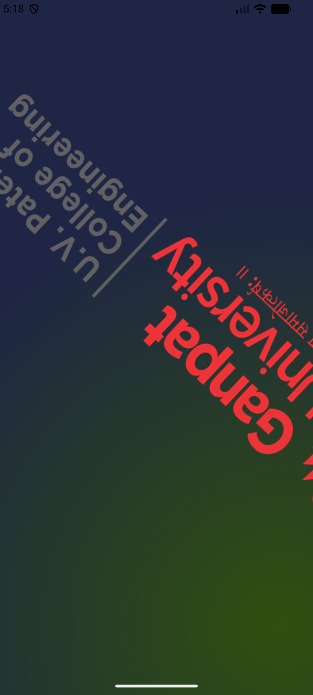
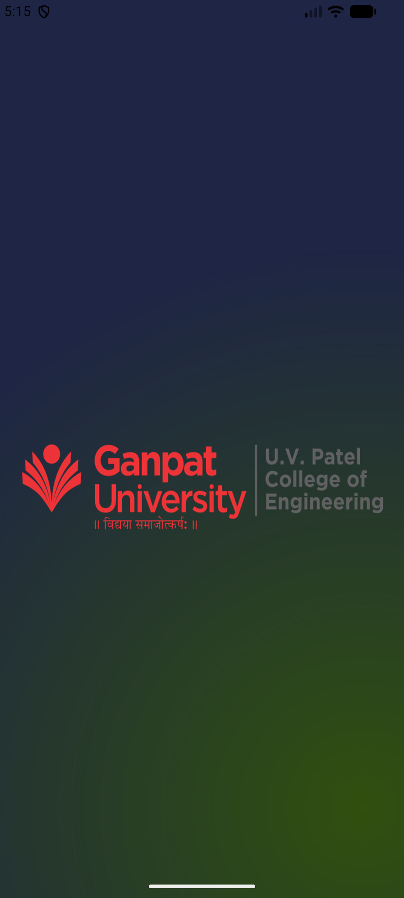
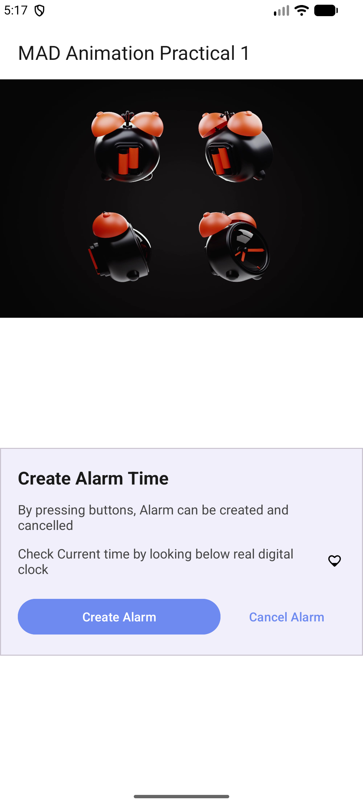
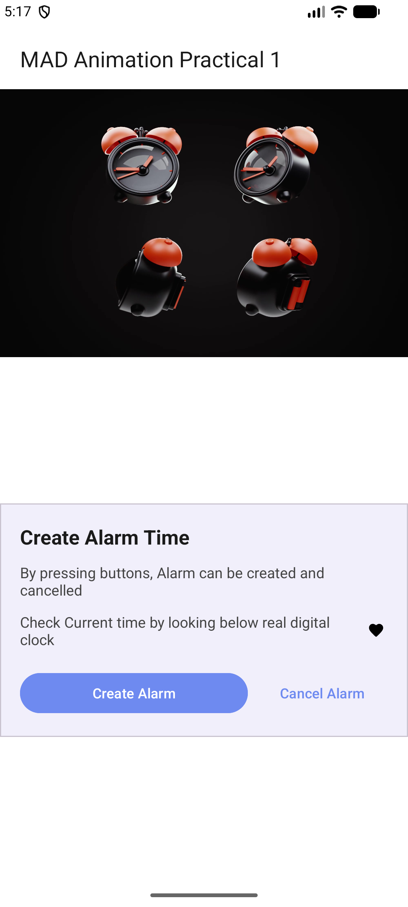

# Practical-6: Frame by Frame Animation & Twin Animation

## AIM & Objective
Create an Android Application to demonstrate **Frame by Frame Animation** and a **Splash Screen** to demonstrate **Twin Animation**.

---

## Concepts & Components Used
- ImageView
- Frame by Frame Animation
- Twin Animation
- AnimationDrawable
- AnimationUtils
- Animation Listener
- onWindowFocusChanged()
- `<animation-list>` and `oneshot`
- `<set>`, `<scale>`, `<translate>`, `<rotate>`, `<alpha>`
- `android:startOffset`
- `android:duration`
- Edge-to-Edge Display
- Immersive Mode
- `<gradient>` and `<shape>`
- Intent
- `finish()`
- `overridePendingTransition()`

---

## 📱 Output

### 🎬 Demo Video

[Watch Demo Video](demo_pr6.mp4)

### 🖼️ Screenshots

#### Splash Screen - Animation

<table>
  <tr>
    <td></td>
    <td></td>
  </tr>
</table>

#### Main Screen - Frame by Frame Animation

<table>
  <tr>
    <td></td>
    <td></td>
  </tr>
</table>

---

## Student Details
- **Enrollment No:** 24012011143
- **Practical:** 06
- **Subject:** Mobile Application Development (MAD)

---

## Conclusion
Successfully implemented **Frame by Frame Animation, Twin Animation, Splash Screen, Edge-to-Edge Display, and XML-based animations** in an Android application.
```
